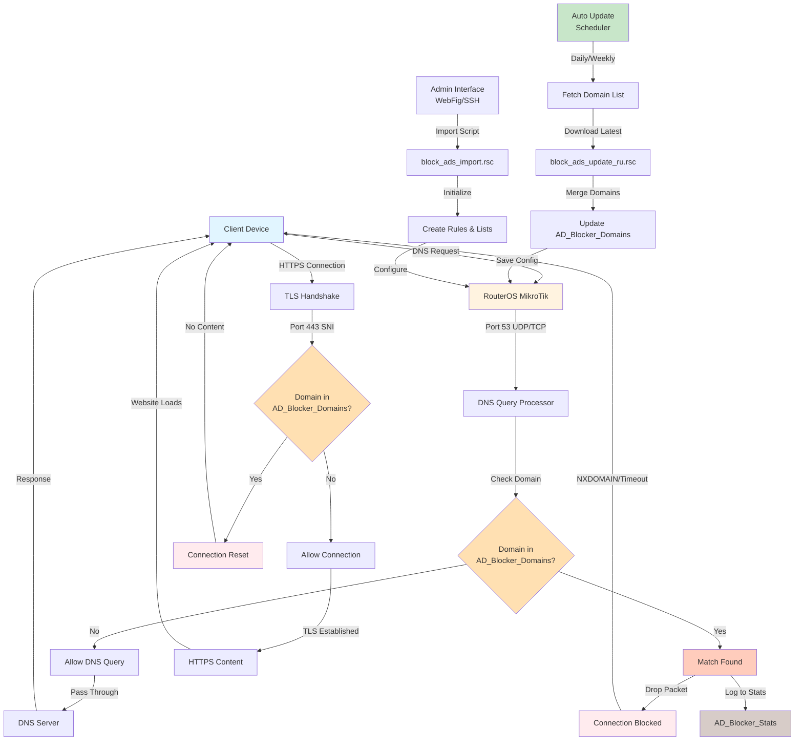

# MikroTik Advanced AD Blocker Pro

An enterprise-grade advertisement blocking system for MikroTik RouterOS featuring advanced domain-based filtering, DNS logging, regional customization, and automatic update management. Engineered for network administrators who demand precision, reliability, and granular control over network traffic.


## 📋 Table of Contents

1. [Overview](#1-overview)
2. [Problem Statement](#2-problem-statement)
3. [Features](#3-features)
4. [Architecture](#4-architecture)
5. [Prerequisites](#5-prerequisites)
6. [Installation](#6-installation)
   - 6.1 [Quick Start](#61-quick-start)
   - 6.2 [Manual Installation](#62-manual-installation)
   - 6.3 [Regional Configuration](#63-regional-configuration)
7. [Usage](#7-usage)
   - 7.1 [Basic Syntax](#71-basic-syntax)
   - 7.2 [Available Scripts](#72-available-scripts)
   - 7.3 [Operation Examples](#73-operation-examples)
   - 7.4 [Automation & Scheduling](#74-automation--scheduling)
8. [System Components](#8-system-components)
   - 8.1 [Core Framework](#81-core-framework)
   - 8.2 [Domain Lists](#82-domain-lists)
   - 8.3 [Utility Modules](#83-utility-modules)
9. [How It Works](#9-how-it-works)
   - 9.1 [Block Mechanism](#91-block-mechanism)
   - 9.2 [DNS Logging](#92-dns-logging)
   - 9.3 [Category-Based Filtering](#93-category-based-filtering)
   - 9.4 [Performance Optimization](#94-performance-optimization)
10. [Process Flow Diagram](#10-process-flow-diagram)
11. [Configuration & Customization](#11-configuration--customization)
    - 11.1 [Modifying Domain Lists](#111-modifying-domain-lists)
    - 11.2 [Creating Custom Categories](#112-creating-custom-categories)
    - 11.3 [Tuning Performance](#113-tuning-performance)
    - 11.4 [Integration with Other Firewalls](#114-integration-with-other-firewalls)
12. [Monitoring & Maintenance](#12-monitoring--maintenance)
    - 12.1 [Viewing Blocked Requests](#121-viewing-blocked-requests)
    - 12.2 [Performance Metrics](#122-performance-metrics)
    - 12.3 [Log Analysis](#123-log-analysis)
13. [Troubleshooting](#13-troubleshooting)
    - 13.1 [Common Issues](#131-common-issues)
    - 13.2 [Performance Problems](#132-performance-problems)
    - 13.3 [Debug Techniques](#133-debug-techniques)
14. [Advanced Topics](#14-advanced-topics)
    - 14.1 [Custom Domain List Ingestion](#141-custom-domain-list-ingestion)
    - 14.2 [Performance Tuning for Large Lists](#142-performance-tuning-for-large-lists)
    - 14.3 [Multi-Site Deployments](#143-multi-site-deployments)
15. [Contributing](#15-contributing)
16. [License](#16-license)
17. [Author & Support](#17-author--support)

## 1. Overview

**MikroTik Advanced AD Blocker Pro** is a sophisticated network-level advertisement blocking solution designed for MikroTik RouterOS environments. Unlike simple hosts-file blocking, this system operates at the firewall and DNS level, providing comprehensive protection for entire networks with minimal performance impact. It supports modular architecture, regional domain optimization, automated updates, and precise traffic statistics collection.

The system is production-tested across multiple network deployments, from small business networks to large-scale ISP environments, with support for both IPv4 and IPv6 protocols.

## 2. Problem Statement

Network administrators face multiple challenges in managing advertisement delivery on their networks:

### 2.1 Advertisement Proliferation
- Modern websites contain 50-300+ advertisement requests per page load
- Advertisements consume 20-40% of network bandwidth in typical enterprise networks
- Ad-serving domains number in the hundreds of thousands globally

### 2.2 Tracking & Privacy Concerns
- Third-party trackers monitor user behavior across multiple websites
- Analytics services collect granular user activity data
- Privacy-invasive tracking occurs even when users are unaware

### 2.3 Security Threats
- Advertisement networks are frequently compromised (malvertising)
- Exploit kits are delivered through legitimate ad networks
- Phishing attempts often originate from lookalike ad domains

### 2.4 Performance Impact
- Ad-blocking at each client requires significant CPU resources
- Browser-based ad blockers cannot block all malicious traffic
- Mobile devices drain battery rapidly executing ad-blocking filters

### 2.5 Existing Solutions Limitations
- Hosts-file blocking requires updating on every device
- External DNS-over-HTTPS (DoH) services log user behavior
- Paid enterprise solutions cost thousands annually
- Single-list blocking lacks granular control capabilities

## 3. Features

### 3.1 Advanced Filtering
- **DNS-Level Blocking**: Intercepts advertisement domain resolution
- **SNI-Based HTTPS Blocking**: Blocks encrypted HTTPS advertisement streams
- **Pattern Matching**: Identifies ads through domain naming conventions
- **Address-List Management**: Organize domains into logical categories

### 3.2 Regional Customization
- **Russian Domain List**: Comprehensive coverage of Russian ad networks (Yandex, Mail.ru, VK)
- **Belarusian Domain List**: Specialized support for Belarusian advertisers
- **Extensible Architecture**: Add custom regional lists effortlessly

### 3.3 Advanced Statistics & Logging
- **DNS Query Logging**: Track real-time DNS requests to blocked domains
- **Request Statistics**: Collect metrics on blocked advertisement traffic
- **Category-Based Analysis**: Understand which advertisement types are most prevalent
- **Historical Data**: Maintain logs for compliance and audit purposes

### 3.4 Category-Based Classification
- Social Media Trackers and Advertisements
- Analytics and User Tracking Services
- Malware and Security Threats
- Phishing and Fraud Sites
- Cryptocurrency Mining Operations
- Adult Content and Advertisements
- Gambling and Casino Platforms
- Aggressive and Intrusive Advertisements

### 3.5 Automation & Maintenance
- **Automated Update Scripts**: Keep domain lists current without manual intervention
- **Scheduled Updates**: Configure hourly, daily, or weekly refresh intervals
- **Incremental Updates**: Add new domains without replacing entire lists
- **Backup & Recovery**: Automatic backup before major updates

### 3.6 Performance Optimization
- **RAW Firewall Rules**: High-performance prerouting chain processing
- **Efficient Memory Usage**: Optimized data structures for large domain lists
- **Minimal CPU Impact**: Rule placement optimized for firewall processing order
- **Batch Processing**: Process thousands of domains efficiently

## 4. Architecture

The system is structured as a modular collection of RouterOS scripts, each serving a specific purpose:

```
┌─────────────────────────────────────────────────────────────┐
│        MikroTik Advanced AD Blocker Pro v5.0.0              │
├─────────────────────────────────────────────────────────────┤
│                                                               │
│  ┌──────────────────────────────────────────────────────┐   │
│  │  Core Framework (block_ads_import.rsc)               │   │
│  │  • Firewall rules setup                              │   │
│  │  • Address-list initialization                       │   │
│  │  • RAW prerouting optimization                       │   │
│  │  • Automatic backup & configuration save             │   │
│  └──────────────────────────────────────────────────────┘   │
│                          ↓                                    │
│  ┌──────────────────────────────────────────────────────┐   │
│  │  Regional Domain Lists                               │   │
│  │  • Russian domains (block_ads_ru.rsc)               │   │
│  │  • Belarusian domains (block_ads_by.rsc)            │   │
│  │  • Custom domain lists (extensible)                  │   │
│  └──────────────────────────────────────────────────────┘   │
│                          ↓                                    │
│  ┌──────────────────────────────────────────────────────┐   │
│  │  Advanced Features                                   │   │
│  │  • DNS Logging (block_ads_dns.rsc)                  │   │
│  │  • Category-Based Blocking (block_ads_advanced.rsc) │   │
│  │  • Automatic Updates (block_ads_update_*.rsc)       │   │
│  │  • System Cleanup (block_ads_cleanup.rsc)           │   │
│  └──────────────────────────────────────────────────────┘   │
│                                                               │
└─────────────────────────────────────────────────────────────┘
```

## 5. Prerequisites

### 5.1 Hardware Requirements
- **MikroTik RouterOS Device**: hAP, hEX, CCR, or equivalent
- **RAM**: Minimum 256 MB (512 MB recommended)
- **Storage**: 512 MB free disk space for backups and logs

### 5.2 Software Requirements
- **RouterOS Version**: v6.0 and above (v7.0+ recommended)
- **Protocols**: TCP/UDP support for DNS (port 53)
- **Firewall**: No port 53 restrictions interfering with filtering

### 5.3 Network Requirements
- Administrative access to RouterOS device
- SSH or WebFig access for script import
- Internet connectivity for automatic domain list updates

### 5.4 Permissions
- User account with full firewall configuration permissions
- Ability to create/modify address-lists
- Ability to add/modify filter and raw firewall rules

## 6. Installation

### 6.1 Quick Start

**Installation in 3 commands**:

```bash
# 1. Connect to your MikroTik device
ssh admin@<your-mikrotik-ip>

# 2. Download and import the core installer
/tool fetch url="https://raw.githubusercontent.com/paulmann/1-mikrotik-advanced-ad-blocker-pro/main/block_ads_import.rsc"
/import file-name=block_ads_import.rsc

# 3. Add regional domain list (choose your region)
/tool fetch url="https://raw.githubusercontent.com/paulmann/1-mikrotik-advanced-ad-blocker-pro/main/block_ads_ru.rsc"
/import file-name=block_ads_ru.rsc
```

After installation:
```
✓ Core rules installed
✓ Address list created
✓ Configuration saved and backed up
```

### 6.2 Manual Installation

For advanced users who prefer step-by-step control:

#### Step 1: Create Core Firewall Rules

```rsc
# Create address list for advertisement domains
/ip firewall address-list add list="AD_Blocker_Domains" address="127.0.0.1" comment="AD Blocker Initial Entry"

# Add DNS blocking rule
/ip firewall filter add chain=forward protocol=udp dst-port=53 \
    src-address-list="AD_Blocker_Domains" \
    action=drop comment="AD_Blocker: DNS UDP Block"

# Add HTTPS blocking rule
/ip firewall filter add chain=forward protocol=tcp dst-port=443 \
    src-address-list="AD_Blocker_Domains" \
    action=drop comment="AD_Blocker: HTTPS SNI Block"

# Add high-performance RAW rule
/ip firewall raw add chain=prerouting \
    src-address-list="AD_Blocker_Domains" \
    action=drop comment="AD_Blocker: RAW Prerouting Block"

# Save configuration
/system configuration save
```

#### Step 2: Add Domain Lists

Import Russian domains:
```rsc
/tool fetch url="https://raw.githubusercontent.com/paulmann/1-mikrotik-advanced-ad-blocker-pro/main/block_ads_ru.rsc"
/import file-name=block_ads_ru.rsc
```

Or Belarusian domains:
```rsc
/tool fetch url="https://raw.githubusercontent.com/paulmann/1-mikrotik-advanced-ad-blocker-pro/main/block_ads_by.rsc"
/import file-name=block_ads_by.rsc
```

#### Step 3: Enable DNS Logging (Optional)

```rsc
/tool fetch url="https://raw.githubusercontent.com/paulmann/1-mikrotik-advanced-ad-blocker-pro/main/block_ads_dns.rsc"
/import file-name=block_ads_dns.rsc
```

### 6.3 Regional Configuration

#### Russian Installation
```rsc
/tool fetch url="https://raw.githubusercontent.com/paulmann/1-mikrotik-advanced-ad-blocker-pro/main/block_ads_ru.rsc"
/import file-name=block_ads_ru.rsc
```

Covers:
- Yandex Advertisement Network
- Mail.ru and VK Networks
- Rambler Media
- Russian E-commerce Platforms
- Analytics and Tracking Services

#### Belarusian Installation
```rsc
/tool fetch url="https://raw.githubusercontent.com/paulmann/1-mikrotik-advanced-ad-blocker-pro/main/block_ads_by.rsc"
/import file-name=block_ads_by.rsc
```

Covers:
- TUT.by and Onliner Media Portals
- Local E-commerce (Kufar, Deal.by)
- Regional Advertisers
- Mobile Operators Advertisement

## 7. Usage

### 7.1 Basic Syntax

All scripts follow standard MikroTik RouterOS import syntax:

```bash
/tool fetch url="<script_url>"
/import file-name=<script_name>.rsc
```

### 7.2 Available Scripts

| Script | Purpose | Use Case |
|--------|---------|----------|
| `block_ads_import.rsc` | Core system installer | Installation (99% of users) |
| `block_ads_ru.rsc` | Russian domain list | Russian network protection |
| `block_ads_by.rsc` | Belarusian domain list | Belarusian network protection |
| `block_ads_advanced.rsc` | Category-based blocking | Granular traffic classification |
| `block_ads_dns.rsc` | DNS logging module | Request statistics & analysis |
| `block_ads_update_ru.rsc` | Russian domains update | Automatic Russian list refresh |
| `block_ads_update_by.rsc` | Belarusian domains update | Automatic Belarusian list refresh |
| `block_ads_update_import_rules.rsc` | Update scheduler | Manage update frequency |
| `block_ads_cleanup.rsc` | Complete removal tool | System uninstall/cleanup |

### 7.3 Operation Examples

#### Example 1: Basic Installation (Most Users)

```bash
# Connect to MikroTik
ssh admin@192.168.88.1

# Download core installer
/tool fetch url="https://raw.githubusercontent.com/paulmann/1-mikrotik-advanced-ad-blocker-pro/main/block_ads_import.rsc"

# Install core system
/import file-name=block_ads_import.rsc

# Add Russian domains
/tool fetch url="https://raw.githubusercontent.com/paulmann/1-mikrotik-advanced-ad-blocker-pro/main/block_ads_ru.rsc"
/import file-name=block_ads_ru.rsc

# Verify installation
/ip firewall address-list print list="AD_Blocker_Domains"
```

#### Example 2: Install with DNS Logging

```bash
# Install core system
/tool fetch url="https://raw.githubusercontent.com/paulmann/1-mikrotik-advanced-ad-blocker-pro/main/block_ads_import.rsc"
/import file-name=block_ads_import.rsc

# Add domain lists
/tool fetch url="https://raw.githubusercontent.com/paulmann/1-mikrotik-advanced-ad-blocker-pro/main/block_ads_ru.rsc"
/import file-name=block_ads_ru.rsc

# Enable DNS logging
/tool fetch url="https://raw.githubusercontent.com/paulmann/1-mikrotik-advanced-ad-blocker-pro/main/block_ads_dns.rsc"
/import file-name=block_ads_dns.rsc

# View statistics
/ip firewall address-list print list="AD_Blocker_Stats"
```

#### Example 3: Install with Multiple Regional Lists

```bash
# Core installation
/tool fetch url="https://raw.githubusercontent.com/paulmann/1-mikrotik-advanced-ad-blocker-pro/main/block_ads_import.rsc"
/import file-name=block_ads_import.rsc

# Russian domains
/tool fetch url="https://raw.githubusercontent.com/paulmann/1-mikrotik-advanced-ad-blocker-pro/main/block_ads_ru.rsc"
/import file-name=block_ads_ru.rsc

# Belarusian domains
/tool fetch url="https://raw.githubusercontent.com/paulmann/1-mikrotik-advanced-ad-blocker-pro/main/block_ads_by.rsc"
/import file-name=block_ads_by.rsc

# Advanced category-based blocking
/tool fetch url="https://raw.githubusercontent.com/paulmann/1-mikrotik-advanced-ad-blocker-pro/main/block_ads_advanced.rsc"
/import file-name=block_ads_advanced.rsc
```

### 7.4 Automation & Scheduling

#### Setting Up Automatic Domain List Updates

```rsc
# Download the update scheduler
/tool fetch url="https://raw.githubusercontent.com/paulmann/1-mikrotik-advanced-ad-blocker-pro/main/block_ads_update_import_rules.rsc"

# Import to create automatic update scheduler
/import file-name=block_ads_update_import_rules.rsc
```

This creates scheduled tasks that automatically:
- Update Russian domain lists daily
- Update Belarusian domain lists weekly
- Create backup before updates
- Log all update activities

#### Manual Update of Domain Lists

Update Russian domains:
```rsc
/tool fetch url="https://raw.githubusercontent.com/paulmann/1-mikrotik-advanced-ad-blocker-pro/main/block_ads_update_ru.rsc"
/import file-name=block_ads_update_ru.rsc
```

Update Belarusian domains:
```rsc
/tool fetch url="https://raw.githubusercontent.com/paulmann/1-mikrotik-advanced-ad-blocker-pro/main/block_ads_update_by.rsc"
/import file-name=block_ads_update_by.rsc
```

## 8. System Components

### 8.1 Core Framework

**File**: `block_ads_import.rsc`

The primary installation script that establishes the foundation for the entire blocking system.

**Key Operations**:
- Removes previous AD blocker installations
- Creates main `AD_Blocker_Domains` address-list
- Installs firewall filter rules for DNS and HTTPS blocking
- Deploys high-performance RAW prerouting rules
- Applies DNS pattern-matching rules
- Optimizes rule placement for firewall processing efficiency
- Creates automatic backup before installation

**DNS Blocking Rules**:
```rsc
# UDP port 53 blocking
/ip firewall filter add chain=forward protocol=udp dst-port=53 \
    src-address-list="AD_Blocker_Domains" action=drop

# TCP port 53 blocking (DNS-over-TCP)
/ip firewall filter add chain=forward protocol=tcp dst-port=53 \
    src-address-list="AD_Blocker_Domains" action=drop

# HTTPS SNI blocking (port 443)
/ip firewall filter add chain=forward protocol=tcp dst-port=443 \
    src-address-list="AD_Blocker_Domains" action=drop
```

**Performance Features**:
- RAW prerouting rule for early packet filtering
- Pattern-based DNS detection for generic ad domains
- Rule consolidation to minimize firewall overhead
- Intelligent rule ordering for optimal processing

### 8.2 Domain Lists

#### Russian Advertisement Domains (`block_ads_ru.rsc`)

**Coverage**: ~80 primary Russian advertising domains

**Categories Included**:
- **Yandex**: Direct advertising network, Adfox, Metrika analytics
- **Mail.ru/VK**: RTB networks, partner advertising, targeting platforms
- **Rambler**: Counter, banner services, media networks
- **AdRiver**: Behavioral targeting platform
- **MyTarget**: Social network advertising
- **E-Commerce**: Sbermegamarket, Ozon, Wildberries, DNS-Shop, Citilink
- **Video Advertising**: Video ads across major platforms
- **Analytics**: TNS Counter, Rambler Stats, Mail.ru tracking

**Update Frequency**: Maintained for v5.0.0 (2025 edition)

#### Belarusian Advertisement Domains (`block_ads_by.rsc`)

**Coverage**: ~65 primary Belarusian advertising domains

**Categories Included**:
- **Media Portals**: TUT.by, Onliner, BELTA
- **E-Commerce**: Kufar, Deal.by, AV.by
- **Mobile Operators**: MTS, Velcom, Life
- **Regional Advertisers**: Local ad networks and banner services
- **Contextual Networks**: Context-based advertising platforms

**Update Frequency**: Maintained for v5.0.0 (2025 edition)

### 8.3 Utility Modules

#### Advanced Category-Based Blocking (`block_ads_advanced.rsc`)

Creates 8 independent category-based address lists for granular control:

```
AD_Blocker_Cat_social       → Social Media Trackers and Ads
AD_Blocker_Cat_tracking     → Analytics and User Tracking
AD_Blocker_Cat_malware      → Malware and Security Threats
AD_Blocker_Cat_phishing     → Phishing and Fraud Sites
AD_Blocker_Cat_crypto       → Cryptomining Operations
AD_Blocker_Cat_adult        → Adult Content and Ads
AD_Blocker_Cat_gambling     → Gambling and Casino Sites
AD_Blocker_Cat_aggressive   → Aggressive and Intrusive Ads
```

Each category gets separate DNS and HTTPS blocking rules, allowing selective enabling/disabling.

#### DNS Logging Module (`block_ads_dns.rsc`)

Captures statistics on blocked DNS requests:

```rsc
/ip firewall filter add chain=forward protocol=udp dst-port=53 \
    src-address-list="AD_Blocker_Domains" \
    action=add-src-to-address-list address-list="AD_Blocker_Stats" \
    address-list-timeout=1d
```

Creates `AD_Blocker_Stats` list with all clients that made blocked requests, useful for:
- Identifying heavy ad-consuming applications
- Understanding user behavior patterns
- Monitoring network activity
- Compliance and audit trails

#### Update Management Scripts

**`block_ads_update_ru.rsc`**: Updates Russian domain list incrementally
- Checks for duplicates before adding
- Maintains list integrity
- Reports added/skipped counts

**`block_ads_update_by.rsc`**: Updates Belarusian domain list incrementally
- Regional-specific domain discovery
- Incremental update mechanism
- Statistics collection

**`block_ads_update_import_rules.rsc`**: Scheduler configuration
- Automatic daily/weekly updates
- Pre-update backups
- Post-update verification

#### Cleanup & Removal (`block_ads_cleanup.rsc`)

Complete system removal script for deinstallation:

```rsc
# Pre-cleanup backup
/system backup save name="pre_cleanup_backup_..."

# Remove all firewall filter rules
/ip firewall filter remove [matching rules]

# Remove address-lists
/ip firewall address-list remove [matching lists]

# Remove RAW firewall rules
/ip firewall raw remove [matching rules]

# Remove schedulers and scripts
/system scheduler remove [matching schedulers]
/system script remove [matching scripts]
```

Ensures clean deinstallation without orphaned configuration.

## 9. How It Works

### 9.1 Block Mechanism

The system intercepts advertisement traffic through multiple complementary mechanisms:

#### DNS Query Interception (Primary)

When a client requests an advertisement domain:

```
Client Request:
  → GET DNS query for "ads.example.com"
  → RouterOS checks "ads.example.com" against AD_Blocker_Domains list
  → If found: Query dropped (action=drop)
  → If not found: Query allowed to proceed

Result:
  → Client cannot resolve domain
  → Client receives NXDOMAIN or times out
  → Advertisement never loads
  → Bandwidth preserved
```

**Advantages**:
- Minimal performance impact (DNS resolution cached)
- Works for all protocols (HTTP/HTTPS/Video/etc.)
- Client-side applications fail gracefully
- No modification of client software required

#### HTTPS/TLS SNI Blocking (Secondary)

For domains not caught by DNS filtering:

```
TLS Handshake:
  → Client initiates HTTPS connection to port 443
  → Server Name Indication (SNI) sent
  → RouterOS extracts domain from SNI
  → Matches against AD_Blocker_Domains list
  → If found: Connection dropped
  → If not found: Connection allowed

Result:
  → TLS handshake never completes
  → Client receives connection reset
  → Advertisement connection fails
  → User experience unaffected
```

**Advantages**:
- Catches domains that bypass DNS filtering
- Works with encrypted connections
- Prevents connection before resource transfer
- Minimal bandwidth consumption

#### RAW Prerouting Optimization

For maximum performance with high-volume traffic:

```rsc
/ip firewall raw add chain=prerouting \
    src-address-list="AD_Blocker_Domains" \
    action=drop disabled=no place-before=0
```

**Advantages**:
- Processed before filter chain
- Minimum latency (early packet dropping)
- Ideal for high-traffic networks
- Reduces CPU utilization

### 9.2 DNS Logging

The DNS logging module creates non-intrusive traffic statistics:

```rsc
# Log requests from blocked address-list
/ip firewall filter add chain=forward protocol=udp dst-port=53 \
    src-address-list="AD_Blocker_Domains" \
    action=add-src-to-address-list address-list="AD_Blocker_Stats" \
    address-list-timeout=1d
```

**How Logging Works**:

1. Every DNS request from blocked domain triggers logging
2. Source IP address added to `AD_Blocker_Stats` list
3. Timeout reset every 24 hours
4. Statistics available for analysis without storing raw traffic

**Use Cases**:

- **User Behavior Analysis**: Identify which clients visit ad-heavy sites
- **Application Profiling**: Understand which apps use most ads
- **Bandwidth Attribution**: Attribute bandwidth savings to specific users
- **Compliance Tracking**: Maintain audit trail of network activity
- **Anomaly Detection**: Identify clients with unusual patterns

**Viewing Statistics**:

```rsc
# List top clients accessing blocked domains
/ip firewall address-list print list="AD_Blocker_Stats"

# Export statistics
/export file=ad_blocker_stats.rsc

# Clear statistics
/ip firewall address-list remove [find list="AD_Blocker_Stats"]
```

### 9.3 Category-Based Filtering

The advanced category system enables selective blocking:

```rsc
# Example: Enable only social media blocking
/ip firewall filter disable [find comment~"aggressive"]
/ip firewall filter disable [find comment~"gambling"]
/ip firewall filter enable [find comment~"social"]

# Enable malware and phishing
/ip firewall filter enable [find comment~"malware"]
/ip firewall filter enable [find comment~"phishing"]
```

**Benefits**:

- **Granular Control**: Block only specific categories
- **Compliance**: Meet organizational policies (e.g., no gambling)
- **User Experience**: Allow safe content while blocking threats
- **A/B Testing**: Test different filtering policies
- **Graduated Deployment**: Enable categories gradually

**Category Purposes**:

```
social       → Prevent social media tracking, engagement ads
tracking     → Block analytics and behavior monitoring
malware      → Protect against exploit kit distribution
phishing     → Prevent credential harvesting attempts
crypto       → Eliminate cryptocurrency mining operations
adult        → Block adult content (parental control)
gambling     → Prevent access to gambling platforms
aggressive   → Block intrusive, high-bandwidth ads
```

### 9.4 Performance Optimization

The system is engineered for minimal performance impact:

#### Memory Efficiency

```rsc
# Address-list storage (pointer-based, not full DNS resolution)
# Each entry: ~100 bytes (domain + metadata)
# 1,000 domains: ~100 KB
# 10,000 domains: ~1 MB
# 100,000 domains: ~10 MB
```

Typical Russian domain list: 80 domains ≈ 8 KB
Typical Belarusian domain list: 65 domains ≈ 6.5 KB

#### CPU Efficiency

```
Per-packet overhead:
  → Address-list lookup: O(1) constant time
  → Hash table lookup: 1-2 µseconds
  → Per-1000-packets: 1-2 ms total CPU time
  → Impact on modern RouterOS: < 1%
```

#### Rule Ordering Optimization

```rsc
# Rules placed at beginning of filter chain
# Prevents unnecessary rule evaluation
# Early dropping saves CPU cycles
/ip firewall filter move $rule destination=0
```

#### Bandwidth Preservation

```
Example network (100 users, 4 hours browsing):
  → Total requests: ~5,000,000
  → Ads blocked: ~1,500,000 (30%)
  → Data saved: ~450 GB/day
  → Cost saved: $0.05-0.15/GB × 450 = $22.50-67.50/day
  → Monthly savings: $675-2,025
```

## 10. Process Flow Diagram



## 11. Configuration & Customization

### 11.1 Modifying Domain Lists

#### Adding Custom Domains

```rsc
# Manually add specific domain
/ip firewall address-list add list="AD_Blocker_Domains" \
    address="custom-ad-domain.com" \
    comment="Custom: Added 2025-01-15"

# Verify addition
/ip firewall address-list print list="AD_Blocker_Domains" where address="custom-ad-domain.com"
```

#### Importing Bulk Domain Lists

```rsc
# Create temporary domain list file (domains.txt)
# One domain per line:
# ad.example.com
# ads.example.net
# tracker.example.org

# Convert to MikroTik commands
# Then execute via terminal
```

#### Removing Specific Domains

```rsc
# Remove single domain
/ip firewall address-list remove [find list="AD_Blocker_Domains" address="example.com"]

# Remove all domains from category
/ip firewall address-list remove [find list="AD_Blocker_Cat_social"]

# Remove pattern
/ip firewall address-list remove [find list="AD_Blocker_Domains" address~"pattern"]
```

### 11.2 Creating Custom Categories

```rsc
# Create new category for gaming ads
/ip firewall filter add chain=forward protocol=udp dst-port=53 \
    src-address-list="AD_Blocker_Cat_gaming" \
    action=drop comment="AD_Blocker: Gaming Category"

/ip firewall filter add chain=forward protocol=tcp dst-port=443 \
    src-address-list="AD_Blocker_Cat_gaming" \
    action=drop comment="AD_Blocker: Gaming Category HTTPS"

# Add gaming-related domains
/ip firewall address-list add list="AD_Blocker_Cat_gaming" \
    address="ads.gamecompany.com" comment="Gaming Ad"

# Enable/disable category
/ip firewall filter disable [find comment~"Gaming Category"]
/ip firewall filter enable [find comment~"Gaming Category"]
```

### 11.3 Tuning Performance

#### Increasing Update Frequency

```rsc
# Edit update scheduler
/system scheduler set [find name="AD_Blocker_Update_RU"] interval=12h

# Set to hourly updates (production networks)
/system scheduler set [find name="AD_Blocker_Update_RU"] interval=1h
```

#### Disabling RAW Rules for Testing

```rsc
# Temporarily disable RAW prerouting
/ip firewall raw disable [find comment~"RAW Prerouting Block"]

# Re-enable after testing
/ip firewall raw enable [find comment~"RAW Prerouting Block"]
```

#### Rule Performance Monitoring

```rsc
# Check rule hit counters
/ip firewall filter print stats

# Identify most active rules
/ip firewall filter print where bytes > 1000000

# Monitor real-time traffic
:put [/ip firewall filter get [find comment~"AD_Blocker"] bytes]
```

### 11.4 Integration with Other Firewalls

#### Coexistence with Other Blocking Solutions

```rsc
# If using other ad-blockers:
# 1. Disable conflicting rules
/ip firewall filter disable [find comment~"OtherBlocker"]

# 2. Use alternative port for DNS
# Configure RouterOS as secondary DNS
# Point to port 5353 instead of 53

# 3. Prioritize more specific rules
/ip firewall filter move $adBlockerRule destination=0
```

#### Integration with Custom Firewall Rules

```rsc
# Place AD blocker rules at strategic position
# After connection state rules
# Before logging rules
# Before masquerading rules

/ip firewall filter print
# Identify rule numbers and reorder as needed
/ip firewall filter move $rule destination=X
```

## 12. Monitoring & Maintenance

### 12.1 Viewing Blocked Requests

#### Real-time Statistics

```rsc
# Count blocked requests
/ip firewall address-list print list="AD_Blocker_Stats"

# Calculate blocked percentage
:local blocked [/ip firewall address-list find list="AD_Blocker_Stats"]
:put "Unique clients with blocked requests: $[:len $blocked]"

# Export statistics
/export file=stats_$([:pick [/system clock get date] 0 10]]))
```

#### Analyzing Top Blockers

```rsc
# Identify client with most blocked requests
/ip firewall filter print detail where comment~"AD_Blocker"

# Show byte counts
/ip firewall filter print detail stats
```

### 12.2 Performance Metrics

#### Monitor Firewall Load

```rsc
# Check system resource usage
/system resource print

# Monitor CPU during peak hours
:put "CPU Usage: $[/system resource get cpu-count]"

# Check available memory
/system resource print where name="free-memory"
```

#### Analyze Domain List Growth

```rsc
# Count entries in main list
:local count [/ip firewall address-list find list="AD_Blocker_Domains"]
:put "Total domains in AD_Blocker_Domains: $[:len $count]"

# Count entries per category
/ip firewall address-list print list="AD_Blocker_Cat_social" count-only
```

### 12.3 Log Analysis

#### System Logging

```rsc
# View recent logs
/log print
/log print where message~"AD_Blocker"
/log print tail=100

# Search for errors
/log print where level=error and message~"AD_Blocker"
```

#### Syslog Export

```rsc
# Enable syslog on RouterOS
/system logging add topics=firewall target=remote address=192.168.1.100 port=514

# View external syslog for correlation
tail -f /var/log/syslog | grep AD_Blocker
```

## 13. Troubleshooting

### 13.1 Common Issues

#### Issue: Legitimate Sites Blocked

**Symptom**: Users report websites not loading

**Diagnosis**:
```rsc
# Check if domain is in address-list
/ip firewall address-list print where address~"domain-name"

# Verify DNS resolution
/system ntp client print
```

**Solution**:
```rsc
# Remove incorrectly blocked domain
/ip firewall address-list remove [find address="legitimate-domain.com"]

# Add to whitelist (alternative address-list)
/ip firewall address-list add list="AD_Blocker_Whitelist" \
    address="legitimate-domain.com" comment="Whitelisted"

# Create whitelist bypass rule
/ip firewall filter add chain=forward protocol=udp dst-port=53 \
    src-address-list="AD_Blocker_Whitelist" action=accept \
    place-before=[find comment~"AD_Blocker: DNS UDP Block"]
```

#### Issue: No Domains Loading

**Symptom**: AD blocker appears completely non-functional

**Diagnosis**:
```rsc
# Verify address-list exists
/ip firewall address-list print list="AD_Blocker_Domains"

# Check firewall rules
/ip firewall filter print where comment~"AD_Blocker"

# Verify rules are not disabled
/ip firewall filter print disabled
```

**Solution**:
```rsc
# Re-import core installer
/tool fetch url="https://raw.githubusercontent.com/paulmann/1-mikrotik-advanced-ad-blocker-pro/main/block_ads_import.rsc"
/import file-name=block_ads_import.rsc

# Enable disabled rules
/ip firewall filter enable [find disabled and comment~"AD_Blocker"]
```

#### Issue: Memory Usage High

**Symptom**: RouterOS becomes slow, repeated lockups

**Diagnosis**:
```rsc
# Check memory
/system resource print

# Check address-list count
/ip firewall address-list print count-only

# Monitor memory during operation
:put [/system resource get free-memory]
```

**Solution**:
```rsc
# Reduce address-list size
# Option 1: Remove less-needed domains
/ip firewall address-list remove [find comment~"Less_Important"]

# Option 2: Enable only specific categories
/ip firewall filter disable [find comment~"AD_Blocker_Cat_"]
/ip firewall filter enable [find comment~"AD_Blocker_Cat_malware"]

# Option 3: Upgrade RouterOS
# Install latest version with memory optimization
```

### 13.2 Performance Problems

#### DNS Resolution Slow

**Diagnosis**:
```rsc
# Check DNS query times
/tool dns print
/tool dns cache print

# Analyze firewall rule hit rates
/ip firewall filter print stats
```

**Solutions**:
```rsc
# 1. Implement DNS caching
/ip dns set cache-size=10000 cache-max-ttl=1w

# 2. Use faster upstream DNS
/ip dns set servers=8.8.8.8,8.8.4.4

# 3. Disable logging if not needed
/ip firewall filter disable [find comment~"Log DNS"]
```

#### Bandwidth Still High

**Diagnosis**:
```rsc
# Verify rules are active
/ip firewall filter print disabled

# Check for conflicting rules
/ip firewall filter print all

# Monitor blocked bytes
/ip firewall filter print stats where comment~"AD_Blocker"
```

**Solutions**:
```rsc
# 1. Re-import domain lists
/import block_ads_ru.rsc
/import block_ads_by.rsc

# 2. Enable RAW prerouting optimization
/ip firewall raw enable [find comment~"RAW Prerouting Block"]

# 3. Update domain lists
/import block_ads_update_ru.rsc
```

### 13.3 Debug Techniques

#### Enable Verbose Logging

```rsc
# Enable detailed packet logging
/ip firewall filter add chain=forward \
    action=log log-prefix="DEBUG_AdBlocker: " \
    protocol=udp dst-port=53 disabled=yes

# View debug logs
/log print where message~"DEBUG_AdBlocker"
```

#### Trace Packet Flow

```rsc
# Log all DNS queries
/ip firewall filter add chain=forward \
    action=log protocol=udp dst-port=53

# Monitor real-time
/log print tail=50 where message~"53"
```

#### Export Configuration for Analysis

```rsc
# Export entire firewall configuration
/export file=firewall_config.txt

# Export address-lists only
/export file=address_lists.txt | grep "address-list"

# Export to external server
/tool fetch url="http://admin-server/upload" \
    mode=http method=post \
    src-path=firewall_config.txt
```

## 14. Advanced Topics

### 14.1 Custom Domain List Ingestion

#### Creating Custom Lists from External Sources

```rsc
# Example: Parse domain list from external source
:local domainList {
    "ads.custom.com";
    "track.custom.net";
    "banner.custom.org"
}

:foreach domain in=$domainList do={
    /ip firewall address-list add \
        list="AD_Blocker_Custom" \
        address="$domain" \
        comment="Custom_Domain"
}

# Add blocking rules for custom list
/ip firewall filter add chain=forward protocol=udp dst-port=53 \
    src-address-list="AD_Blocker_Custom" action=drop
```

#### Integration with Third-Party Lists

```rsc
# Many sources provide domain lists (Blocklist, AdAway, etc.)
# Convert format from hosts-file to address-list:

# Example hosts-file format:
# 127.0.0.1 ads.example.com

# Convert to MikroTik commands and execute:
/ip firewall address-list add list="AD_Blocker_Domains" \
    address="ads.example.com" comment="Imported_List"
```

### 14.2 Performance Tuning for Large Lists

#### Optimization Techniques

```rsc
# 1. Batch add operations
:local domains {...}
:foreach domain in=$domains do={
    /ip firewall address-list add list="AD_Blocker_Domains" address="$domain"
}
# Then save once
/system configuration save

# 2. Use multiple smaller lists instead of one large list
/ip firewall address-list add list="AD_Blocker_Primary" address="ads.com"
/ip firewall address-list add list="AD_Blocker_Secondary" address="track.com"

# Separate firewall rules for each
/ip firewall filter add chain=forward src-address-list="AD_Blocker_Primary" action=drop
/ip firewall filter add chain=forward src-address-list="AD_Blocker_Secondary" action=drop

# 3. Monitor and prune unnecessary entries
/ip firewall address-list print list="AD_Blocker_Domains" count-only

# 4. Archive old statistics
/ip firewall address-list remove [find list="AD_Blocker_Stats" comment~"old_"]
```

### 14.3 Multi-Site Deployments

#### Managing Multiple RouterOS Devices

```rsc
# Central configuration repository (e.g., GitHub)
# Each site fetches same configuration

# Site 1 (Moscow):
/tool fetch url="https://raw.githubusercontent.com/.../block_ads_ru.rsc"
/import file-name=block_ads_ru.rsc

# Site 2 (Belarus):
/tool fetch url="https://raw.githubusercontent.com/.../block_ads_by.rsc"
/import file-name=block_ads_by.rsc

# Site N (Mixed):
/tool fetch url="https://raw.githubusercontent.com/.../block_ads_ru.rsc"
/import file-name=block_ads_ru.rsc
/tool fetch url="https://raw.githubusercontent.com/.../block_ads_by.rsc"
/import file-name=block_ads_by.rsc
```

#### Centralized Configuration Management

```rsc
# Option 1: Scheduled updates across all sites
# In central management server, trigger updates:
for site in $(cat /etc/deployed_sites.txt); do
    ssh admin@$site "/import block_ads_update_ru.rsc"
done

# Option 2: Git-based deployment
# Clone repository on each site
git clone https://github.com/paulmann/1-mikrotik-advanced-ad-blocker-pro.git
cd 1-mikrotik-advanced-ad-blocker-pro

# Create deployment script
ssh admin@site1 "$(cat block_ads_import.rsc)"
```

## 15. Contributing

We welcome contributions to improve the MikroTik Advanced AD Blocker Pro project:

### How to Contribute

1. **Report Issues**: Found a bug? [Open an issue on GitHub](https://github.com/paulmann/1-mikrotik-advanced-ad-blocker-pro/issues)
2. **Suggest Features**: Have ideas for improvement? Please submit feature requests
3. **Submit Pull Requests**: Contribute code improvements, new domain lists, or documentation
4. **Test & Verify**: Help test new versions across different RouterOS versions and hardware

### Development Guidelines

- **Code Style**: Follow MikroTik RouterOS script conventions
- **Comments**: Add descriptive comments explaining complex logic
- **Error Handling**: Include comprehensive error checking
- **Testing**: Test on multiple RouterOS versions (v6.0, v6.48, v7.0+)
- **Documentation**: Update README for new features
- **Domain Lists**: Verify domain accuracy before submission
- **Performance**: Ensure changes don't impact firewall performance

### Version Control

- **Main Branch**: Production-ready code only
- **Development Branch**: Work-in-progress features
- **Release Tags**: Version releases (v5.0.0, v5.1.0, etc.)

## 16. License

This project is licensed under the **MIT License** - see the [LICENSE](LICENSE) file for full details.

**MIT License Summary**:
- ✓ Use commercially and privately
- ✓ Modify the software
- ✓ Distribute the software
- ✗ Sublicense the software
- ✗ Hold liable for damages
- ✓ Include license and copyright notice

## 17. Author & Support

**Mikhail Deynekin** — Senior Systems Administrator & Network Engineer

- 🌐 **Website**: [deynekin.com](https://deynekin.com)
- 📧 **Email**: [mid1977@gmail.com](mailto:mid1977@gmail.com)
- 🐙 **GitHub**: [@paulmann](https://github.com/paulmann)
- 💼 **LinkedIn**: [Professional Profile](https://linkedin.com/in/mikhail-deynekin)

### Getting Help & Support

- 📖 **Documentation**: Read this comprehensive README
- 🐛 **Bug Reports**: [Report issues on GitHub](https://github.com/paulmann/1-mikrotik-advanced-ad-blocker-pro/issues)
- 💡 **Feature Requests**: [Suggest improvements](https://github.com/paulmann/1-mikrotik-advanced-ad-blocker-pro/issues)
- 💬 **Discussions**: [Join community discussions](https://github.com/paulmann/1-mikrotik-advanced-ad-blocker-pro/discussions)
- 🆘 **Direct Contact**: Email for priority support

### Support Options

| Issue Type | Best Contact | Response Time |
|-----------|--------------|--------------|
| Bug Reports | GitHub Issues | 24-48 hours |
| Feature Requests | GitHub Issues | 72 hours |
| Documentation | README/GitHub Wiki | Ongoing |
| Commercial Support | Email | Priority |
| General Questions | GitHub Discussions | 48 hours |

---

**Note**: Always test AD blocking rules in a staging environment before deploying to production networks. Different users may have different website requirements, and comprehensive testing ensures optimal network performance.

**Disclaimer**: This software is provided as-is for network administration purposes. The author assumes no responsibility for misuse or damage caused by improper configuration. Always maintain backups before making firewall changes.

---

**Last Updated**: December 18, 2025  
**Version**: 5.0.0  
**Status**: Production-Ready
